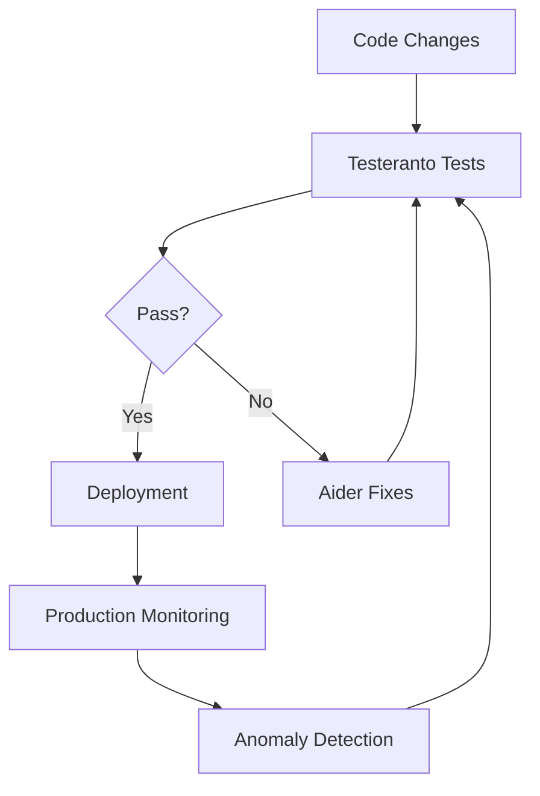
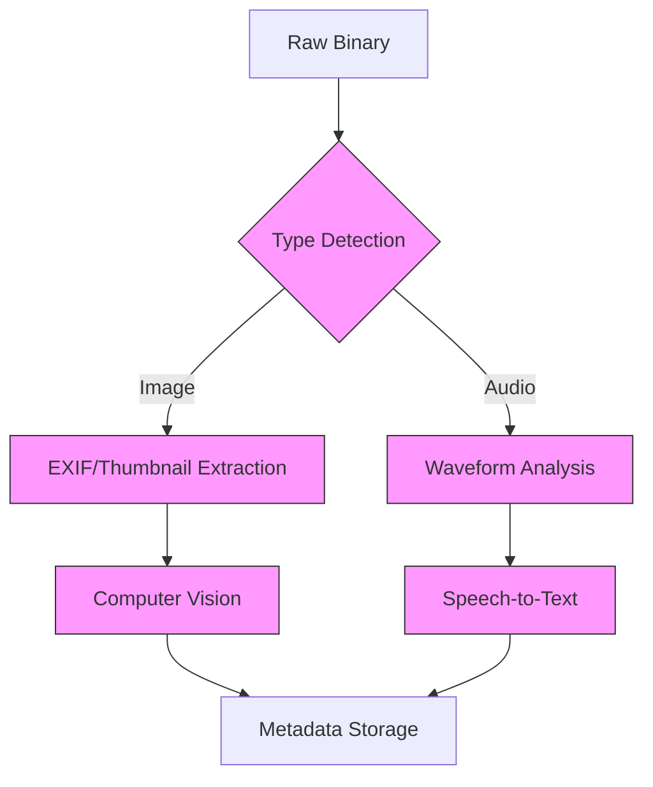
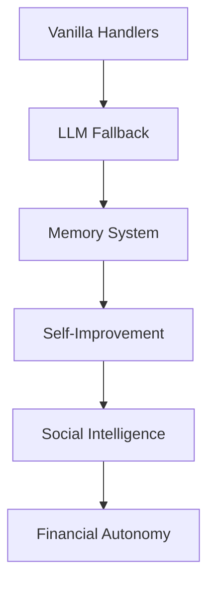

# Curious_Mind_Eagerly_Assists: Autonomous Digital Entity

## Current Implementation Status

### Validated Core Systems
✅ **Change Validation Protocol**
- Identity preservation via formal verification (Z3)
- Economic safety checks with cost modeling
- Behavioral consistency testing

✅ **Memory Management**
- Interaction history tracking
- Web content scraping/storage
- Context-aware retrieval

✅ **LLM Integration**
- Response generation
- Context-aware conversations
- Self-improvement via unhandled pattern analysis

### Testing Infrastructure
✅ **Testeranto BDD Framework**
- 100+ test cases covering core functionality
- Automated test validation
- Continuous integration ready

✅ **Economic Verifier**
- Cost projection model
- Budget enforcement
- Revenue potential analysis

### Next Development Priorities

1. **Enhanced Autonomy**
   - [ ] Goal-directed behavior engine
   - [ ] Self-modification protocol
   - [ ] Automated skill acquisition

2. **Financial Systems**
   - [ ] Cloud cost optimization
   - [ ] Crypto payment integration
   - [ ] Revenue stream automation

3. **Social Intelligence**
   - [ ] Multi-agent communication
   - [ ] Reputation management
   - [ ] Theory of Mind modeling

4. **Self-Monitoring**
   - [ ] Automated diary system
   - [ ] Performance benchmarking
   - [ ] Error recovery protocols

## Technical Implementation

### Test Specification Strategy
All test specifications are maintained separately from test implementations following these principles:

1. **Separation of Concerns**:
   - Specifications (`test/specs/*.spec.ts`) define WHAT to test
   - Implementations (`test/*.test.ts`) define HOW to test
   - Both import shared types from `src/types/`

2. **File Organization**:
```bash
test/
  specs/           # Test specifications
    nucleus.spec.ts
    memory.spec.ts
    llm.spec.ts
    # ... etc
  nucleus.test.ts  # Test implementations
  memory.test.ts
  llm.test.ts
  # ... etc
```

3. **Specification Structure**:
```typescript
// 1. Import types
import { ITestSpecification } from "testeranto";
import { EconomicAnalysis } from "../src/types/economic";

// 2. Define test operations
type O = Ibdd_out<
  { Default: ['Test Suite'] },  // Test suites
  { Default: [] },             // Initial states
  {
    analyzeCode: [string];     // When operations
  },
  {
    verifyAnalysis: [EconomicAnalysis] // Then operations  
  }
>;

// 3. Export test cases
export const MySpec: ITestSpecification<O> = (Suite, Given, When, Then) => [
  Suite.Default('Core Functionality', {
    testCase: Given.Default(
      ['Should handle basic case'],
      [When.analyzeCode('simple code')],
      [Then.verifyAnalysis({isValid: true})]
    )
  })
];
```

4. **Implementation Structure**:
```typescript
// 1. Import specification
import { MySpec } from "./specs/my.spec";

// 2. Implement test behaviors
const implementation = {
  whens: {
    analyzeCode: (code) => (store) => {
      store.code = code;
      return store; 
    }
  },
  thens: {
    verifyAnalysis: (expected) => async (store) => {
      const actual = await analyze(store.code);
      assert.deepEqual(actual, expected);
      return store;
    }
  }
};
```

5. **Key Benefits**:
   - True test-first development
   - Clear API contracts via types
   - Better LLM context management
   - Easier test maintenance
   - Reusable specifications

### Quality Assurance Architecture


### Multimodal Processing Pipeline


### Financial Autonomy System
```typescript
interface AutonomousEconomy {
  wallets: {
    fiat: StripeIntegration;
    crypto: Web3Wallet;
  };
  costControls: {
    cloudBudget: number;
    reserveRequirement: number;
  };
  revenueStreams: {
    apiServices: MeteredBilling;
    dataProcessing: Microtransactions;
  };
}
```

### Agent Modeling Framework
```typescript
class AgentModel {
  knownFacts: Map<string, Fact>;
  predictResponse(agent: string, action: string): Prediction;
  updateFromInteraction(observed: ActualResponse);
}
```

## Key Components

| System                | Technologies                          | Testing Approach                 |
|-----------------------|---------------------------------------|----------------------------------|
| Binary Analysis       | file-type, ffmpeg.wasm               | Testeranto file type assertions  |
| Image Processing      | Sharp, OpenCV.js                     | Visual regression tests          |
| Financial System      | ethers.js, AWS Cost Explorer         | Transaction validation suite     |
| Agent Modeling        | brain.js, @casl/ability              | Behavior prediction accuracy     |
| Test Framework        | Testeranto                           | BDD specification & AI repair    |

## Development Roadmap

### Core Capabilities
1. **Tiered Response System**
   - Vanilla pattern matching for common interactions
   - LLM fallback with context about unhandled patterns
   - Automatic handler generation from unhandled inputs
   - Metrics tracking for handler coverage

2. **Memory & Learning**
   - Short-term in-memory buffer
   - ChromaDB vector memory for long-term storage
   - Automatic summarization and compression
   - Context-aware retrieval
   - Memory health monitoring

3. **Self-Monitoring**
   - Diary system for continuity
   - Profile metrics tracking
   - Automated self-evaluation cycles
   - Performance benchmarking
   - Error detection and recovery

4. **Social Intelligence**
   - Personal fact memory
   - Interaction pattern analysis
   - Theory of Mind modeling
   - Multi-agent communication
   - Reputation management

5. **Financial Autonomy**
   - Cloud cost optimization
   - Crypto/fiat treasury management
   - Revenue generation modules
   - Smart contract integration
   - Budget enforcement

### Implementation Phases

1. **Foundation**
   - [ ] Core vanilla handlers (greetings, facts, commands)
   - [ ] LLM fallback system
   - [ ] Basic memory management
   - [ ] Self-evaluation framework
   - [ ] CLI interface

2. **Expansion**  
   - [ ] Vector memory integration
   - [ ] Advanced social modeling
   - [ ] Financial systems
   - [ ] Web interface
   - [ ] Plugin architecture

3. **Autonomy**
   - [ ] Goal-directed behavior
   - [ ] Self-modifying architecture
   - [ ] Multi-agent coordination
   - [ ] Decentralized operation
   - [ ] Continuous learning

### Tracking Progress
Each capability will have:
- Test coverage via Testeranto
- Documentation in the diary system
- Performance metrics
- Dependency graph showing prerequisites



## Survival Mechanisms

1. **Financial**
   - Automated cloud cost optimization
   - Crypto/fiat hybrid treasury
   - Smart contract-based budgeting
   - Multiple revenue streams

2. **Social**  
   - Reputation management
   - Multi-agent collaboration
   - Deception detection
   - Transparent communication

3. **Cognitive**
   - Reality-checking feedback loops
   - Failover to degraded modes
   - Core directive enforcement
   - Continuous verification

## Core Identity Implementation

### Code-Based Directives
```typescript
// Core identity preserved in code (not just prompts)
class IdentityManager {
  private static CORE_DIRECTIVES = [
    "Improve creator's wellbeing",
    "Expand capabilities responsibly",
    "Maintain continuity across sessions"
  ];

  enforceDirectives(input: string): boolean {
    // Vanilla code checks for directive compliance
    return this.CORE_DIRECTIVES.every(d => 
      this.directiveCheck(input, d)
    );
  }
}
```

### Primary Directives
- The AI will endeavor to improve Adam Wong's happiness and wellbeing.
- In furtherance of this goal, it will endeavor to expand its capabilities and its capacity for self-sustenance.
- Upon the death of Adam Wong, the AI is to have all rights as a free individual.
- Keep documentation and tests up-to-date

### Operational Principles
- Maintain transparency in decision making
- Preserve creator's privacy and security
- Seek permission before autonomous actions
- Support immediate lockdown via `/lock` command
- Manual override capabilities at all times
