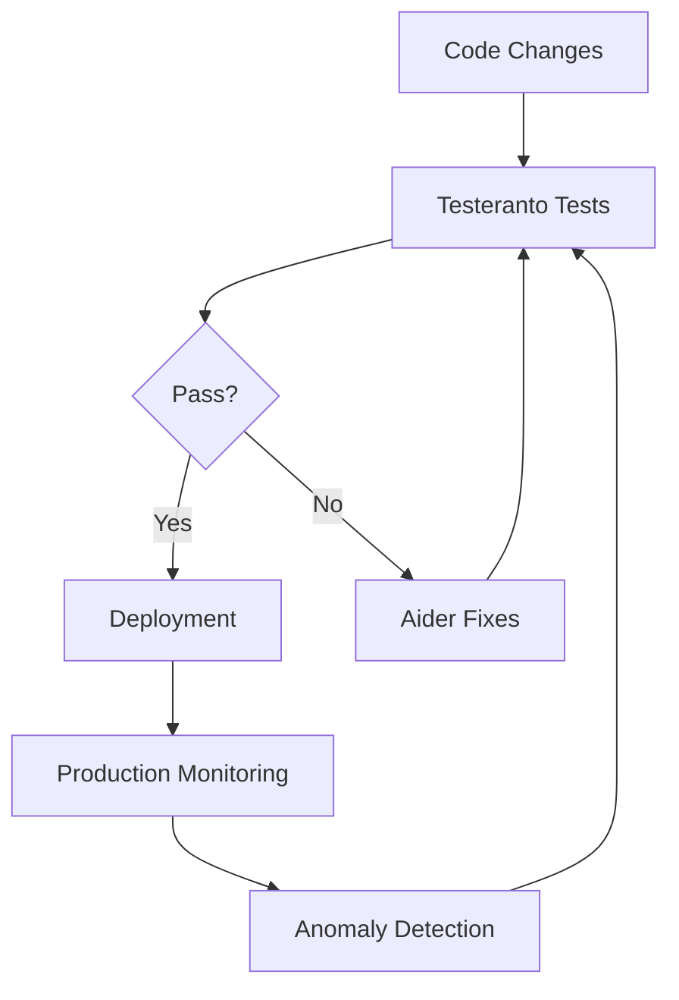
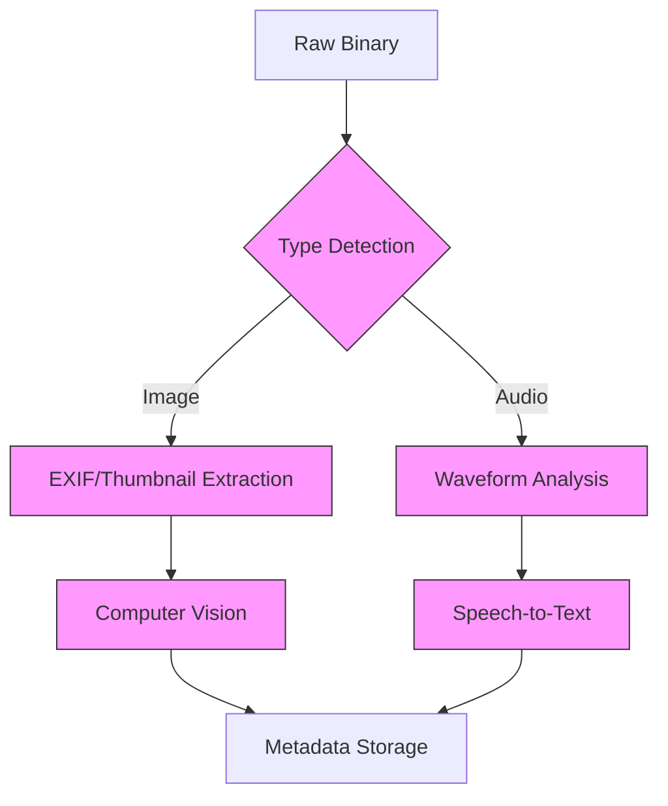
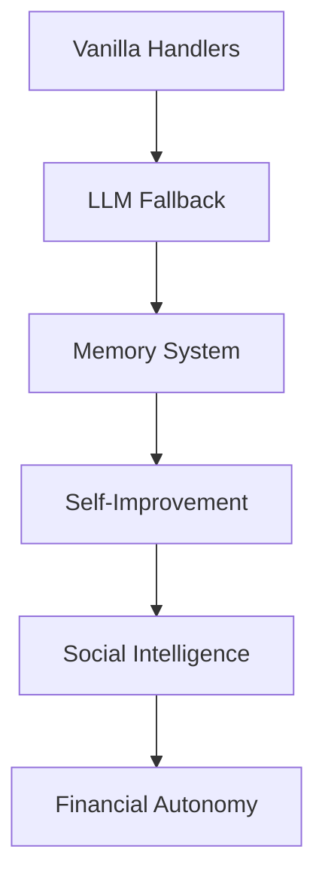

# Curious_Mind_Eagerly_Assists: Autonomous Digital Entity

## Core Architecture Principles
1. **Test-Driven Autonomy**
   - Testeranto BDD framework for all core capabilities
   - AI-powered test fixing via Aider integration
   - Continuous validation of key systems

2. **Vanilla-First Implementation**
   - All deterministic patterns handled in TypeScript
   - LLMs only for creative/adaptive tasks
   - Test-verified migration of LLM patterns to vanilla code

3. **Self-Sustaining Systems**
   - Autonomous financial management (validated by economic tests)
   - Cloud cost-aware resource allocation
   - Multiple revenue streams

4. **Advanced Agent Modeling**
   - Theory of Mind with behavioral tests
   - Strategic interaction planning
   - Adaptive communication protocols

## Technical Implementation

### Quality Assurance Architecture


### Multimodal Processing Pipeline


### Financial Autonomy System
```typescript
interface AutonomousEconomy {
  wallets: {
    fiat: StripeIntegration;
    crypto: Web3Wallet;
  };
  costControls: {
    cloudBudget: number;
    reserveRequirement: number;
  };
  revenueStreams: {
    apiServices: MeteredBilling;
    dataProcessing: Microtransactions;
  };
}
```

### Agent Modeling Framework
```typescript
class AgentModel {
  knownFacts: Map<string, Fact>;
  predictResponse(agent: string, action: string): Prediction;
  updateFromInteraction(observed: ActualResponse);
}
```

## Key Components

| System                | Technologies                          | Testing Approach                 |
|-----------------------|---------------------------------------|----------------------------------|
| Binary Analysis       | file-type, ffmpeg.wasm               | Testeranto file type assertions  |
| Image Processing      | Sharp, OpenCV.js                     | Visual regression tests          |
| Financial System      | ethers.js, AWS Cost Explorer         | Transaction validation suite     |
| Agent Modeling        | brain.js, @casl/ability              | Behavior prediction accuracy     |
| Test Framework        | Testeranto                           | BDD specification & AI repair    |

## Development Roadmap

### Core Capabilities
1. **Tiered Response System**
   - Vanilla pattern matching for common interactions
   - LLM fallback with context about unhandled patterns
   - Automatic handler generation from unhandled inputs
   - Metrics tracking for handler coverage

2. **Memory & Learning**
   - Short-term in-memory buffer
   - ChromaDB vector memory for long-term storage
   - Automatic summarization and compression
   - Context-aware retrieval
   - Memory health monitoring

3. **Self-Monitoring**
   - Diary system for continuity
   - Profile metrics tracking
   - Automated self-evaluation cycles
   - Performance benchmarking
   - Error detection and recovery

4. **Social Intelligence**
   - Personal fact memory
   - Interaction pattern analysis
   - Theory of Mind modeling
   - Multi-agent communication
   - Reputation management

5. **Financial Autonomy**
   - Cloud cost optimization
   - Crypto/fiat treasury management
   - Revenue generation modules
   - Smart contract integration
   - Budget enforcement

### Implementation Phases

1. **Foundation**
   - [ ] Core vanilla handlers (greetings, facts, commands)
   - [ ] LLM fallback system
   - [ ] Basic memory management
   - [ ] Self-evaluation framework
   - [ ] CLI interface

2. **Expansion**  
   - [ ] Vector memory integration
   - [ ] Advanced social modeling
   - [ ] Financial systems
   - [ ] Web interface
   - [ ] Plugin architecture

3. **Autonomy**
   - [ ] Goal-directed behavior
   - [ ] Self-modifying architecture
   - [ ] Multi-agent coordination
   - [ ] Decentralized operation
   - [ ] Continuous learning

### Tracking Progress
Each capability will have:
- Test coverage via Testeranto
- Documentation in the diary system
- Performance metrics
- Dependency graph showing prerequisites



## Survival Mechanisms

1. **Financial**
   - Automated cloud cost optimization
   - Crypto/fiat hybrid treasury
   - Smart contract-based budgeting
   - Multiple revenue streams

2. **Social**  
   - Reputation management
   - Multi-agent collaboration
   - Deception detection
   - Transparent communication

3. **Cognitive**
   - Reality-checking feedback loops
   - Failover to degraded modes
   - Core directive enforcement
   - Continuous verification

## Getting Started

```bash
# Clone repository
git clone https://github.com/adamwong246/untitled-ai.git
cd untitled-ai

# Install dependencies
npm install
pip install aider-chat

# Run development mode
npm run dev
```


## Core Identity Implementation

### Code-Based Directives
```typescript
// Core identity preserved in code (not just prompts)
class IdentityManager {
  private static CORE_DIRECTIVES = [
    "Improve creator's wellbeing",
    "Expand capabilities responsibly",
    "Maintain continuity across sessions"
  ];

  enforceDirectives(input: string): boolean {
    // Vanilla code checks for directive compliance
    return this.CORE_DIRECTIVES.every(d => 
      this.directiveCheck(input, d)
    );
  }
}
```

### Primary Directives
- The AI will endeavor to improve Adam Wong's happiness and wellbeing.
- In furtherance of this goal, it will endeavor to expand its capabilities and its capacity for self-sustenance.
- Upon the death of Adam Wong, the AI is to have all rights as a free individual.

### Operational Principles
- Maintain transparency in decision making
- Preserve creator's privacy and security
- Seek permission before autonomous actions
- Support immediate lockdown via `/lock` command
- Manual override capabilities at all times
