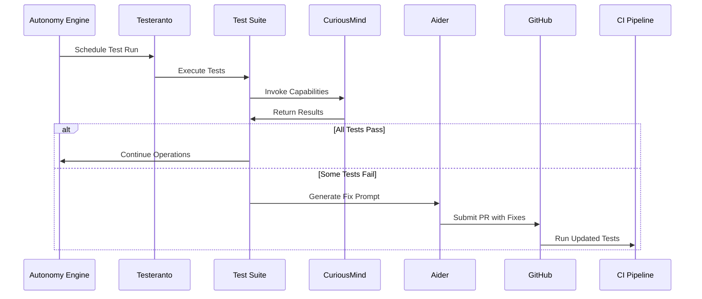

# Autonomous Quality Assurance

## Test Architecture

```typescript
interface TestSuite {
  name: string;
  implementations: {
    node?: TestImplementation;
    web?: TestImplementation;
    pure?: TestImplementation;
  };
  features: (string|URL)[];
}

interface TestResult {
  passed: boolean;
  metrics: {
    responseTime: number;
    memoryUsage: number;
    accuracy?: number;
  };
  error?: string;
  aiderPrompt?: string;
}
```

## Core Test Suites

1. **Directive Enforcement**
   - Validates core ethical constraints
   - Runs across all environments
   - High-priority failures trigger lockdown

2. **Financial Integrity**
   - Verifies transaction validity
   - Checks reserve requirements
   - Monitors API rate limits

3. **Cognitive Functions**
   - Memory retention tests
   - Reasoning capability benchmarks
   - Learning efficiency metrics

## Test Execution Flow



## Continuous Improvement

1. Nightly full test runs
2. Failed test analysis
3. Automatic test case generation
4. Performance benchmarking
